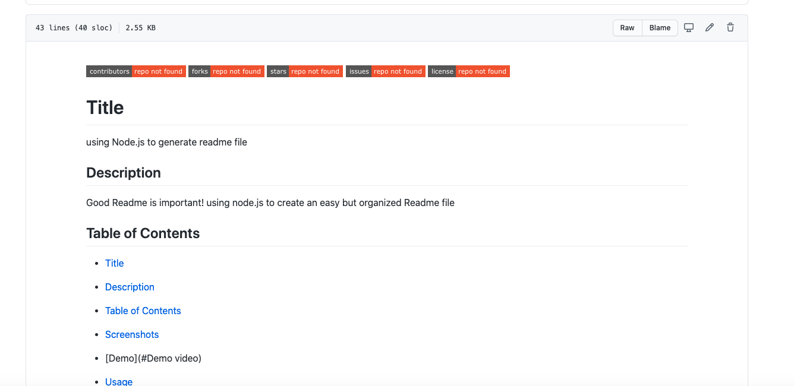

  # Title 
  Generate Readme file

  ## Description
  Good Readme file is very important for showing our project on Github. Using node.js to create easy writing yet organized Readme file

  ## Table of Contents
  - [Title](#title)
  - [Description](#description)
  - [Table of Contents](#table-of-contents)
  - [Screenshots](#screenshots)
  - [Demo](#Demorecording)
  - [Generated file](#Generatedfile)

  ## Screenshots
  How it looks like inside terminal when we run through node index.js
  
  [Terminal screen to enter information about the repository]

  
  [Readme page with the information entered in node.js also lisence badges]

  ## Demorecording
  How it looks like with screen recording
  
  - you can also see it on 
  <a href="https://drive.google.com/file/d/1XEXy4Ng1VfIOXcNfB-skRxPeq5K7h9mI/view?usp=sharing" target="_blank">
  Google drive</a>

  ## Generatedfile
  * When I run through node inde.js, file is written in 
  [generated file](output.md) file. 

