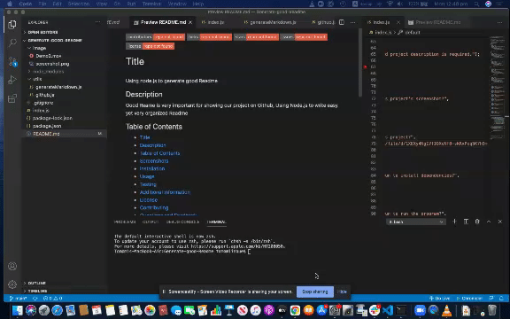

[contributors-shield]: https://img.shields.io/github/contributors/Chib1co/using-Node.js-to-generate-readme-file.svg?style=flat-square
  [contributors-url]: https://github.com/Chib1co/using-Node.js-to-generate-readme-file/graphs/contributors
  [forks-shield]: https://img.shields.io/github/forks/Chib1co/using-Node.js-to-generate-readme-file.svg?style=flat-square
  [forks-url]: https://github.com/Chib1co/using-Node.js-to-generate-readme-file/network/members
  [stars-shield]: https://img.shields.io/github/stars/Chib1co/using-Node.js-to-generate-readme-file.svg?style=flat-square
  [stars-url]: https://github.com/Chib1co/using-Node.js-to-generate-readme-file/stargazers
  [issues-shield]: https://img.shields.io/github/issues/Chib1co/using-Node.js-to-generate-readme-file.svg?style=flat-square
  [issues-url]: https://github.com/Chib1co/using-Node.js-to-generate-readme-file/issues
  [license-shield]: https://img.shields.io/github/license/Chib1co/using-Node.js-to-generate-readme-file.svg?style=flat-square
  [license-url]: https://github.com/Chib1co/using-Node.js-to-generate-readme-file/blob/master/LICENSE.txt
  [![Contributors][contributors-shield]][contributors-url] [![Forks][forks-shield]][forks-url] [![Stargazers][stars-shield]][stars-url] [![Issues][issues-shield]][issues-url] [![License.txt][license-shield]][license-url]
  # Title 
  using Node.js to generate readme file
  ## Description
  Good Readme is important! using node.js to create an easy but organized Readme file
  ## Table of Contents
  - [Title](#title)
  - [Description](#description)
  - [Table of Contents](#table-of-contents)
  - [Screenshots](#screenshots)
  - [Demo](#Demo video)
  - [Usage](#usage)
  
  - [Additional Information](#additional-information)
  - [License](#license)
  - [Questions and Feedback](#questions-and-feedback)
  ## Screenshots
  
  - Installation
  Download (and unpack) or clone the repo, then using a CLI run the `npm install` command.
  - Usage
  Run the application with the CLI command `node index.js` and follow the prompts.
  - Testing
  Run the tests with the CLI command `npm test`.
  - Additional Information
  
  ## Demo recording
  
  ## Questions and Feedback
  Please contact me using one of the following:
 
  - | Github: [Chib1co](https://gist.github.com/Chib1co) |  |
  - Email: chibico1216@gmail.com